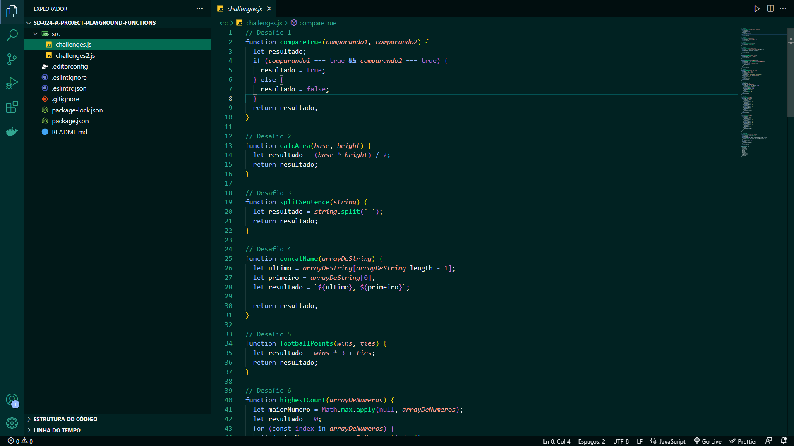

<h1 align="center">Projeto- Playground Functions</h1>

<strong>👨‍💻 O que foi desenvolvido</strong>
 

No time de desenvolvimento, eu fiquei responsável por implementar o código de funções que resolvem problemas com respostas pré-determinadas. Utilizei a lógica de programação para ajudar na análise de cada problema e resposta esperada, facilitando a implementação do código de cada uma das funções.

 

